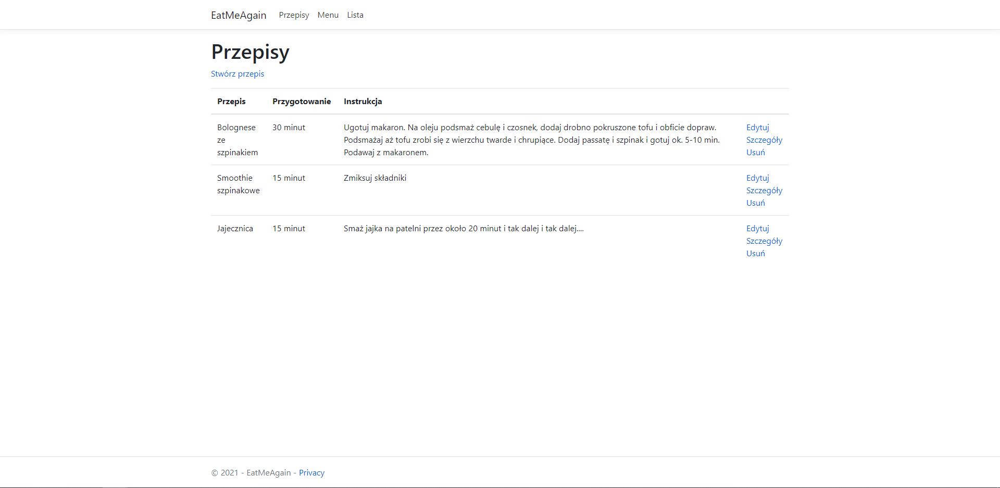
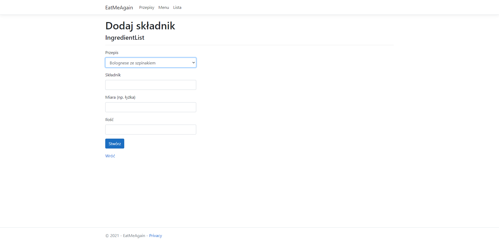
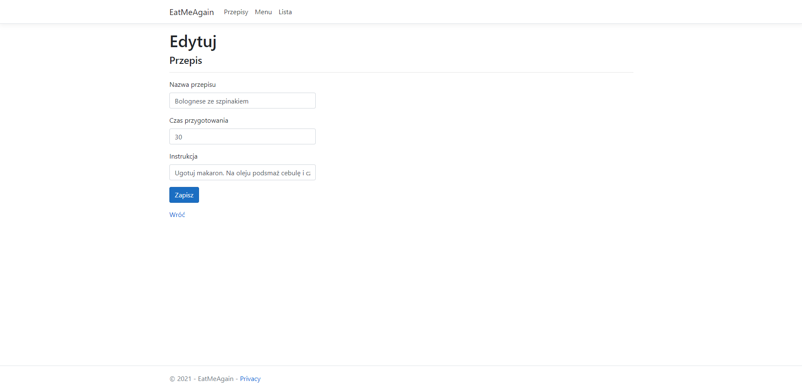
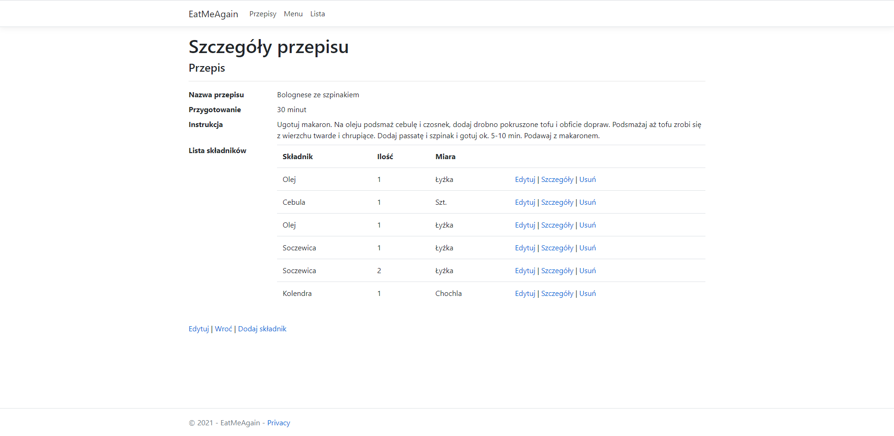

# Eat Me - Aplikacja oparta na ASP.NET
> Aplikacja do tworzenia bazy przepisów.
## Spis treści
* [Informacje ogólne](#Informacje-ogólne)
* [Dokumentacja](#dokumentacja)
* [Technologia](#Technologie)
* [Funkcjonalności](#Funkcjonalności)
* [Status](#status)
* [Kontakt](#kontakt)
## Informacje ogólne
Aplikacja jest przeznaczona dla osób które chcą zebrać w jednym miejscu wszystkie przepisy wraz z instrukcjami.
## Dokumentacja

## Technologie
* ASP.NET 5.0
## Funkcjonalności
1) Przepisy funkcjalności:
* Wyświetl
* Edytuj
* Szczegóły - przenosi do widoku ze składnikami
* Usuń
2) Składniki funkcjonalności:
* Wyświetl
* Edytuj
* Szczegóły
* Usuń
## Kontakt
Damian Jaszewski @damianjaszewski@gmail.com
